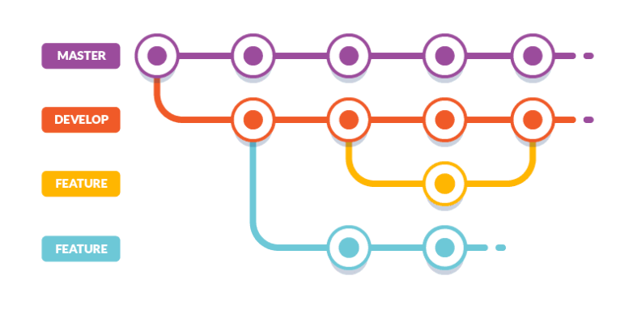

[[_TOC_]]

# Overview

#### What is in this Repository?

This repository is a [monorepo](https://en.wikipedia.org/wiki/Monorepo) that houses the [Storybook](https://storybook.js.org/docs/react/get-started/introduction) UI component development tool and the source code for each UI component sent to the npm registry.

#### What is a UI Component System?

A system for Front-end UI Developers to develop, test, and maintain non-generic UI components in isolation (that can make up the bulk of a product/application UI) with different runtime requirements away from the concerns of application development and in lockstep with Visual Design, Interaction Design, and User Experience design requirements.

#### Why Use a UI Component System?

1. Your organization needs one mechanism/system to maintain unique groups of UI components that make up different products/applications. Instead of building a single generic set of UI components that may or may not be used across multiple products/applications on various devices and platforms.

2. Speed up application/product development and maintain a higher quality UI by delivering the bulk of a UI to application developers using thoroughly designed, tested, versioned, and stateless UI components. Instead of expecting a full stack or front-end application developer to build out the bulk of the UI (including tests) while also developing and architecting the application.

3. Reinforce a clear separation between UI/presentational components and application state within applications that use component tree architectures (i.e., React, Vue, Angular, etc.).

4. Reinforce a clear separation between feature/application specifications and component specifications. Building components in isolation with focused specifications will facilitate the ideal separation of concerns (i.e., the concern/specification with how a button should be built and how the user interacts with it should be separate concern/specification from what exactly needs to happen when a user clicks a button in the application/feature).

#### Where are UI Component Specifications Found?

Specifications for each UI component are built in [Figma](https://www.figma.com/files/project/5301527/Master-2020?fuid=824000860858101014). These specifications are available within the Storybook UI via [storybook-addon-designs](https://github.com/pocka/storybook-addon-designs/tree/master).

Note that component specifications are not application/feature specifications. Component specifications focus squarely on component development and fall-out of application/feature specifications. Component specifications should be grouped by product/application, then by device, if needed, and then subdivided into primitive or domain components.

A domain component is a component that does not have any obvious UI re-use but exists to provide application developers with more than just simplistic and generic re-usable components (e.g., a unique view or specific ["organism"](https://atomicdesign.bradfrost.com/chapter-2/#organisms) to borrow from Atomic Design). These components are often complex and take up a lot of the user's attention and view within a user interface (e.g., an entire header or footer or a complex domain-specific search UI).

Primitive components are typically more generic (e.g., buttons, Icons, Modals, etc.) than specific (e.g., a header) and have an apparent re-usable nature within the UI (i.e., similar to ["Atoms"](https://atomicdesign.bradfrost.com/chapter-2/#atoms) or ["Molecules"](https://atomicdesign.bradfrost.com/chapter-2/#molecules) from Atomic Design). Domain components often consume primitive components.

# How do I use These Components?

The information found in this `README.md` is written for developers who will be developing UI components. To learn how to use a component in your application [refer to the documentation found in the public Storybook](https://locuslabs.gitlab.io/design-system-team/ui-components/?path=/story/ui-component-system-overview-component-usage-themes--page).

Note that all UI components found in this repository are installed using the npm registry and are documented within Storybook which includes a runnable/editable code demo.

e.g. [MOL Tooltip Component Documentation & Demo](https://locuslabs.gitlab.io/design-system-team/ui-components/?path=/docs/mol-components-desktop-primitive-components-tooltip--placement).

# Tools Used In The Development of UI Components

**CI/CD**

- Gitlab
  - [Gitlab CI/CD](https://docs.gitlab.com/ee/ci/README.html)
    - [Docker](http://docker.com/)
      - [cypress/base](https://hub.docker.com/r/cypress/base/)

**Component Delivery**

- [NPM Registry](https://www.npmjs.com/)
  - [NPM Organization](https://www.npmjs.com/search?q=%40locus-labs)

**Development**

- [Node](https://nodejs.org/en/)
- [Yarn 1](https://classic.yarnpkg.com/en/)
  - [Yarn Workspaces](https://classic.yarnpkg.com/en/docs/yarn-workflow)
  - [Yarn Run](https://classic.yarnpkg.com/en/docs/cli/run)
- [Lerna](https://github.com/lerna/lerna#readme)
- [Storybook for React](https://storybook.js.org/docs/react/get-started/introduction)
- [Rollup](https://rollupjs.org/guide/en/)
  - [Babel](https://rollupjs.org/guide/en/#babel)

**UI Components**

- [React](https://reactjs.org/)
  - [prop-types](https://github.com/facebook/prop-types)
  - [react-dom](https://www.npmjs.com/package/react-dom)
- [Styled Components](https://styled-components.com/)
- [Styled System](https://styled-system.com/)
- [ReaKit](https://reakit.io/)
- [Polished](https://polished.js.org/)

**Documentation**

- [MDX](https://mdxjs.com/) (via [Storybook](https://storybook.js.org/docs/react/api/mdx))
- [codesandbox.com](https://codesandbox.io/dashboard/all/?workspace=a1d2b3f3-7ff5-44ef-a529-595fbcd81f1b)
- [shields.io](https://shields.io/category/version)

**Testing & Quality**

- [ESLint](https://eslint.org/)
- [Prettier](https://prettier.io/)
- [StyleLint](https://stylelint.io/)
- [Husky](https://typicode.github.io/husky/#/)
- [Percy](https://percy.io/)
  - [@percy/storybook](https://docs.percy.io/docs/storybook)
- [Cypress](https://www.cypress.io/)
  - [cypress-storybook](https://github.com/NicholasBoll/cypress-storybook)

# Publicly Viewing UI Components via Storybook

Storybook is the tool used for building, viewing, documenting, and testing UI components contained in this repository. A public version of Storybook is available so that anyone can view and interact with the most recently built components.

View & Interact with all UI Components at: [https://locuslabs.gitlab.io/design-system-team/ui-components/](https://locuslabs.gitlab.io/design-system-team/ui-components/)

Note that when the 'dev' branch from this repository is merged into the 'master' branch a built/static version of Storybook will automatically be built and deployed in CI/CD overriding the public Storybook found at the url mentioned above (i.e., deploying Storybook).

# Running Storybook Locally

#### Running Storybook for Development

Follow the steps below to run Storybook locally on your machine for the purpose of active UI component development.

1. Clone repository to your local machine
2. Open a terminal and change directories to the directory you just cloned/downloaded
3. run `yarn run run-storybook` (this script runs `yarn install`)

Storybook will open in a web browser at [http://localhost:6006/](http://localhost:6006/)

Changes to Storybook and components will hot reload in your browser as you develop and save changes.

#### Running the Built/Static Storybook

⚠️ - Before you can run a built/static version of Storybook locally you will need to create a build. See "Building Storybook Locally" below.

1. Clone repository to your local machine
2. Open a terminal and change directories to the directory you just cloned/downloaded
3. run `yarn run run-storybook-build-ci`

Both the development storybook and the static/build storybook run at `http://localhost:6006/` so make sure you only run one at a time.

Note:

1. The static version of Storybook (and thus the UI components) is also the version used for testing in CI/CD (i.e. by eslint, stylelint, Cypress, and Percy)
2. Running `yarn run run-storybook-build-ci` locally does not build a static version of Storybook it simply uses the last built version. However, in CI/CD `yarn run build-storybook` runs before `yarn run run-storybook-build-ci`.

# Building Storybook Locally

The static version of Storybook is used in CI/CD for testing and is the compiled source sent to production (i.e. the public view of [Storybook](https://locuslabs.gitlab.io/design-system-team/ui-components/?path=/docs/ui-component-system-overview-introduction--page)). While you can create and run a static version of Storybook locally this isn't really part of the local development process.

Follow the steps below to build a static version of Storybook locally on your machine. A static version of Storybook entails using [webpack](https://webpack.js.org/) to bundle Storybook and all the stories and components into a version that can be delivered over a network using a couple of files (i.e. bundles) instead of 1000's of files.

1. Clone repository to your local machine
2. Open a terminal and change directories to the directory you just cloned/downloaded
3. run `yarn run build-storybook` (this script runs `yarn install`)

A built/static version of storybook is placed in the directory `built_storybook` directory located in the root of the repository. Again, this is the source that is deployed to [https://locuslabs.gitlab.io/design-system-team/ui-components/](https://locuslabs.gitlab.io/design-system-team/ui-components/) as well the static version of Storybook used in CI/CD during Percy and Cypress testing.

Note that building Storybook locally does not open the built version of Storybook in a web browser it only creates the built version (See Running Storybook Locally > Running the Built/Static Storybook if you want to run the built/static version of Storybook locally).

Want to deploy Storybook to [https://locuslabs.gitlab.io/design-system-team/ui-components/](https://locuslabs.gitlab.io/design-system-team/ui-components/) see "Deploying Storybook".

# Creating Issues & MR's in this Repository

See the wiki page: [Creating Issues & Merge Requests](https://gitlab.com/locuslabs/design-system-team/ui-components/-/wikis/Creating-Issues-&-Merge-Requests-Based-on-Issues)

# Estimating Component Work

See the wiki page: [Estimating Work](https://gitlab.com/locuslabs/design-system-team/ui-components/-/wikis/Estimating-Work)

# Developing UI Components in Storybook

#### Third-party Accounts Needed For Development

| Account                                   | Username/Org                                                                                                | Admin/Owner           | Explanation                                                                                                                                                                      | Get Access                                                                                |
| :---------------------------------------- | :---------------------------------------------------------------------------------------------------------- | :-------------------- | :------------------------------------------------------------------------------------------------------------------------------------------------------------------------------- | :---------------------------------------------------------------------------------------- |
| [Npm](https://www.npmjs.com/)             | [@locus-labs](https://www.npmjs.com/settings/locus-labs/packages)                                           | Cody                  | NPM organization on npm that house all the npm packages. You'll need your own npm account and access to the @locus-labs organization before you can release a component version. | Must have npm account. Ask an admin of npm account to add you to the npm organization.    |
| [Percy](https://percy.io/)                | [Locus-Labs](https://percy.io/Locus-Labs)                                                                   | Cody, Dominika, Julio | Automated visual tests                                                                                                                                                           | Ask an admin of percy account to add you to the percy organization.                       |
| [Lambdatest](https://www.lambdatest.com/) | [LocusLabs](https://accounts.lambdatest.com/detail/team)                                                    | Cody, Dominika, Julio | Manual cross browser testing                                                                                                                                                     | Ask an admin of Lambdatest account to add you to the Lambdatest organization.             |
| [codesandbox.io](https://codesandbox.io/) | [component ui system](https://codesandbox.io/dashboard/all/?workspace=a1d2b3f3-7ff5-44ef-a529-595fbcd81f1b) | Cody, Dominika, Julio | Code Demos in Documentation                                                                                                                                                      | Must have codesandbox.io account. Ask an member of workspace to add you to the workspace. |
| [Figma](https://www.figma.com/)           | [LocusLabs](https://www.figma.com/files/team/636676516548040280/LocusLabs?fuid=824000860858101014)          | Kristen, JP           | Where component specifications are defined/built                                                                                                                                 | Ask an admin of Figma to add you to the team.                                             |

#### Git Workflow

- A "master" branch, always ready to be released
- A "dev" branch, that is merged into "master" for Storybook deployments
- "Bug", "Enhancement", or "New Unit of Work" merge request branches, that are merged into "dev" (often these are called feature branches)

The image below illustrates this type of Git workflow:



#### Component Development Workflow

##### Step 1 - Perquisite

1. Clone repository
2. Git checkout "dev" branch locally

##### Step 2 - Developing

1. Locally, create a "Bug", "Enhancement", or "New Unit of Work" branch by branching the "dev" branch. Name the branch accordingly.
2. Push new branch to gitlab and create a merge request that merges into "dev"
3. Link the merge request (via MR description) to any issue resolved by the merge request
4. Complete the required work within your MR branch. Make sure you push your work to GitLab daily as well as merging the 'dev' branch into your MR.
5. Write all Cypress tests.
6. Make sure any UI components that need to be updated on the npm registry get a manual bump up according to semver (i.e. bump 0.0.1 to 0.0.2)
7. Push your MR to Gitlab.

Note:

- Before moving to step three make sure you have merged the "dev" branch into your MR's branch resolving any merge conflicts. I recommend doing this daily as long as you have a MR's branched off 'dev'.

##### Step 3 - CI/CD & Code Review

1. Make sure all CI/CD pipelines have succeeded (i.e. Cypress, Percy, Linting, Storybook builds etc...)
2. Verify all Percy regressions by viewing the MR's diffs in the Percy UI. If everything looks correct approve the percy changes.
3. Get a code review and approval from a teammate.

##### Step 4 - Merge, MR's into 'dev' branch

1. One last time, merge the 'dev' branch into your MR branch. Resolve any issues.
2. Merge the merge request using gitlab (i.e. merge your branch into dev branch via gitlab.com)

##### Step 5 - Publish Component Packages (as needed)

Skip this step if you don't need to update a UI component on npm.

1. Locally, with the 'dev' branch checkout run the Lerna `build-component-packages-publish-to-npm` script. Lerna will find the package versions you manually changed and ask you if you want to submit a new package to the npm registry.
2. Confirm that you want to submit new packages to npm if you made changes to the UI component.

##### Step 6 - Approve Percy Updates

1. When you finally merge your MR into the "dev" a CI/CD process kicks off updating the dev branch with new percy snapshots. You will need to go into Percy and approve these updates. You have to do this because the 'dev' branch is the canonical snapshot of what production should look like. When you merge your MR into dev and you saying, change the canonical percy snapshot so all future MR's are compared to this new snapshot. When you approve Percy changes in a MR you are only saying, yes I know my MR will effect the canonical snapshot.
2. If you need to update the public Storybook review the "Deploying Storybook" section of this `README.md` file.

#### Using Theme Values During Development

The Styled Components `<ThemeProvider />`, provides the values from the themes to everything that is a child of the `<ThemeProvider />`. Thus, values from the theme can be reached when defining CSS in JS via Styled Components as well as from within the context of the Component itself via `ThemeContext` and `useContext` from React.

Review this [codesandbox](https://codesandbox.io/s/style-system-theme-example-8rm4v?file=/src/Button.js) where a `Button` component is built that pulls values from the theme during component construction.

#### Using Styled System Theme Key Properties in a Theme

Styled System is used to add css centric props to components. However, Styled System is also the mechanism that allows components to make use of named values (e.g. `md`) from themes when using Styled System props.

Remember a theme is basically an object that has named css values:

```js

const theme = {

...

borderWidths: {
 sm: '1px',
 md: '2px',
},

letterSpacings: {
 sm: '0.5px',
 md: '1px',
 lg: '2px',
},

...

}

```

Certain keys in the theme are special (e.g. `borderWidths`) and can be used by Style System props that can pull the keyed values by name from the theme. In other words, Styled System will attempt to find a value based on specific property key name in the theme and fallback to a raw value if the property key name is missing in the theme.

For example in this [codesandbox](https://codesandbox.io/s/style-system-theme-with-styled-system-v1h5v?from-embed) I pass the `Button` component a `borderWidth` value of `"md"` which it uses to extract from the theme a value of `"10px"`.

Below is a list of the [keys used by Style System](https://styled-system.com/theme-specification#key-reference) that can be used within a theme.

<table>
 <thead>
  <tr>
   <th>Theme Key</th>
   <th>CSS Properties</th>
  </tr>
 </thead>
 <tbody>
  <tr>
   <td>
    <code>space</code>
   </td>
   <td>
    <code>margin</code>, <code>margin-top</code>, <code>margin-right</code>,
    <code>margin-bottom</code>, <code>margin-left</code>,
    <code>padding</code>, <code>padding-top</code>,
    <code>padding-right</code>, <code>padding-bottom</code>,
    <code>padding-left</code>, <code>grid-gap</code>,
    <code>grid-column-gap</code>, <code>grid-row-gap</code>
   </td>
  </tr>
  <tr>
   <td>
    <code>fontSizes</code>
   </td>
   <td>
    <code>font-size</code>
   </td>
  </tr>
  <tr>
   <td>
    <code>colors</code>
   </td>
   <td>
    <code>color</code>, <code>background-color</code>,
    <code>border-color</code>
   </td>
  </tr>
  <tr>
   <td>
    <code>fonts</code>
   </td>
   <td>
    <code>font-family</code>
   </td>
  </tr>
  <tr>
   <td>
    <code>fontWeights</code>
   </td>
   <td>
    <code>font-weight</code>
   </td>
  </tr>
  <tr>
   <td>
    <code>lineHeights</code>
   </td>
   <td>
    <code>line-height</code>
   </td>
  </tr>
  <tr>
   <td>
    <code>letterSpacings</code>
   </td>
   <td>
    <code>letter-spacing</code>
   </td>
  </tr>
  <tr>
   <td>
    <code>sizes</code>
   </td>
   <td>
    <code>width</code>, <code>height</code>, <code>min-width</code>,
    <code>max-width</code>, <code>min-height</code>, <code>max-height</code>
   </td>
  </tr>
  <tr>
   <td>
    <code>borders</code>
   </td>
   <td>
    <code>border</code>, <code>border-top</code>, <code>border-right</code>,
    <code>border-bottom</code>, <code>border-left</code>
   </td>
  </tr>
  <tr>
   <td>
    <code>borderWidths</code>
   </td>
   <td>
    <code>border-width</code>
   </td>
  </tr>
  <tr>
   <td>
    <code>borderStyles</code>
   </td>
   <td>
    <code>border-style</code>
   </td>
  </tr>
  <tr>
   <td>
    <code>radii</code>
   </td>
   <td>
    <code>border-radius</code>
   </td>
  </tr>
  <tr>
   <td>
    <code>shadows</code>
   </td>
   <td>
    <code>box-shadow</code>, <code>text-shadow</code>
   </td>
  </tr>
  <tr>
   <td>
    <code>zIndices</code>
   </td>
   <td>
    <code>z-index</code>
   </td>
  </tr>
 </tbody>
</table>

#### Percy Visual Testing Overview

Percy is a third party service ([https://percy.io/Locus-Labs/](https://percy.io/Locus-Labs/)) that takes screenshots of components (based on [Storybook stories](https://docs.percy.io/docs/storybook)) and requires any visual changes/regressions to be reviewed (your merge branch v.s. dev) before a merge request in gitlab can be merged into the development branch (i.e. percy automates the reviewing of visual regressions over time).

Code can't be merged into "dev" unless you validate all UI regressions. Percy, does the work to identify visual changes so you don't have to manually test with your eyes and memory. It creates visual diffs that you have to manually approve.

Note:

- When MR's branches are pushed to gitlab ci/cd will send snapshots of each story (i.e. each component story) to Percy. Percy will notify you if anything visually has changed from the stories in the 'dev' branch.
- When your MR's branch is merged into "dev" branch via gitlab, ci/cd will update Percy so that the updates are added to the base 'dev' snapshots that percy compares MR's too.

#### Cypress Functional Testing Overview

Cypress is used to run end to end tests on components (i.e. Cypress runs isolated stories in an iframe via [cypress-storybook](https://github.com/NicholasBoll/cypress-storybook)). When you commit code to a MR's Cypress will run in CI/CD.

Cypress tests can also be run locally. Follow the steps below to run Cypress locally.

1. Make sure you have Storybook is running locally at [http://localhost:6006/](http://localhost:6006/).
2. Run the package.json script "cypress-open-gui-local" using `yarn run cypress-open-gui-local`
3. The cypress GUI will open and you can begin running tests.

# Deploying Storybook

1. Checkout "dev" and git pull so you have the latest "dev" branch. Verify your merge request is in the "dev" branch.
2. Checkout "master" and git pull.
3. Locally, git merge "dev" into "master"
4. Push "master" to gitlab.com
5. Verify that [https://locuslabs.gitlab.io/design-system-team/ui-components/](https://locuslabs.gitlab.io/design-system-team/ui-components/) has been updated after the gitlab [pipeline](https://gitlab.com/locuslabs/design-system-team/ui-components/-/pipelines) finishes.

By pushing to Master a CI/CD process is kicked off that will automatically build Storybook and deploy it to the public url.

# Adding a New UI Component Group/Set to Storybook

See this [merge request](https://gitlab.com/locuslabs/design-system-team/ui-components/-/merge_requests/196/diffs) and copy the obvious changes required to create a new group/set of components within Storybook, Cypress, and Gitlab CI/CD.

# Tooling Details

#### Configuration File(s) Explained

| File Name            | Explanation                                                                                                                                                                                                                                                                                                                                                                                                                             |
| :------------------- | :-------------------------------------------------------------------------------------------------------------------------------------------------------------------------------------------------------------------------------------------------------------------------------------------------------------------------------------------------------------------------------------------------------------------------------------- |
| `storybook/.babelrc` | Used by storybook (i.e. webpack) to create components inside storybook during development as well as when building a static version of Storybook.js`                                                                                                                                                                                                                                                                                    |
| `yarn.lock`          | Used by yarn to store exactly which versions of each dependency were installed.                                                                                                                                                                                                                                                                                                                                                         |
| `.yarnrc`            | .yarnrc files allow you to configure additional Yarn features.                                                                                                                                                                                                                                                                                                                                                                          |
| `rollup.config.js`   | Used by rollup to build UI component packages for the npm registry. This file also contains the Babel configurations for building components from the source. This is different than the .babelrc file that is used by Storybook to build UI components during development and when running a static version of Storybook. Note that the Bable configuration in this config file should match the configuration in`storybook/.babelrc`. |
| `lerna.json`         | Lerna configuration file see Lerna [docs](https://github.com/lerna/lerna#lernajson) for details.                                                                                                                                                                                                                                                                                                                                        |
| `.stylelintrc`       | Stylelint configuration see file Stylelint [docs](https://stylelint.io/user-guide/configure) for details.                                                                                                                                                                                                                                                                                                                               |
| `cypress.json`       | Cypress configuration file see Cypress [docs](https://docs.cypress.io/guides/references/configuration) for details.                                                                                                                                                                                                                                                                                                                     |
| `.prettierrc.js`     | Prettier configuration file see Prettier [docs](https://prettier.io/docs/en/options.html) for details.                                                                                                                                                                                                                                                                                                                                  |
| `.prettierignore`    | Configure which files should be ignored by Prettier                                                                                                                                                                                                                                                                                                                                                                                     |
| `gitlab-ci.yml`      | CI/CD configuration for gitlab see gitlab CI/CD [docs](https://docs.gitlab.com/ee/ci/yaml/gitlab_ci_yaml.html) for details.                                                                                                                                                                                                                                                                                                             |
| `.eslintignore`      | Configure which files are ignored by ESlint                                                                                                                                                                                                                                                                                                                                                                                             |
| `.eslintrc.json`     | ESlint configuration file see ESlint [docs](https://eslint.org/docs/user-guide/configuring/) for details.                                                                                                                                                                                                                                                                                                                               |
| `.browserslistrc`    | Baseline browsers used by all components, referenced by Babel, ESLint, etc... See Browserslist [repo](https://github.com/browserslist/browserslist) for details.                                                                                                                                                                                                                                                                        |
| `.husky`             | Configure package scripts that should when committing and pushing to git. See Husky [docs](https://typicode.github.io/husky/#/?id=features) for details.                                                                                                                                                                                                                                                                                |

#### Yarn Workspace

The repository is setup to use [Yarn workspace](https://classic.yarnpkg.com/blog/2017/08/02/introducing-workspaces/) so that a single node_modules folder will be used for Storybook and all component packages (as opposed to each package having its own node_modules folder).

An advantage of using Yarn workspaces is that you can import packages you are working on locally into other packages that have not yet been published to npm.

#### The package.json Setup

Keep in mind that this [monorepo](https://en.wikipedia.org/wiki/Monorepo) uses one node_modules folder for both Storybook and individual UI component packages.

The root `package.json` as yarn calls it defines all the development dependencies needed to run Storybook (and anything you add to Storybook). Note that you only add Storybook dependencies to the root `package.json`. ⚠️ You don't add dependencies you define in UI component package.json files in the root `package.json`!

The `package.json` within each UI component package defines all the dependencies and peer dependencies needed to run the component. Dependencies for each UI component package are not added to the root `package.json`.

To add packages you need for Storybook use the yarn `add` command and the `-W` flag to add packages reflect in the root `package.json`.

e.g.

```bash
yarn add --dev -W name-of-package1 name-of-package2
```

To add packages that are needed by a UI component package, either add the dependency manually to the `package.json` for the UI component package or use the lerna `add` command to add a package.

#### Babel Setup

**Component Build via Rollup**

Rollup & Babel are used to create component packages for distribution (i.e. Compiling React and JavaScript 2015+ so it can run in the browsers defined in `.browserlistrc`). Babel is compiling the source and leaving the ES module format (i.e. the code is not in a commonjs format). This is done because the assumption is that the components will be consumed in a ES module situation (i.e. webpack, parcel, rollup.js etc. in the context of a React application). The Babel configuration for Rollup is found in `rollup.config.js`.

**Storybook Build via Webpack**

Babel is used by Storybook through Webpack. The configuration Storybook will use when developing in Storybook or building a static version of storybook can be found in `/.storybook/babelrc`.

# Prior Art

UI Components:

- [Ant Design](https://ant.design/components/overview/)
- [Racine](https://seeds.sproutsocial.com/components/)
- [Material-UI](https://material-ui.com/)
- [Chakra](https://chakra-ui.com/)
- [WUI](https://www.welcome-ui.com/)
- [Blueprint](https://blueprintjs.com/docs/)
- [Bold](https://bold.bridge.ufsc.br/en/)
- [Base](https://baseweb.design/)
- [Spectrum](https://react-spectrum.adobe.com/react-spectrum/index.html)

Theory:

- [Component Driven User Interfaces](https://www.componentdriven.org/) & [Component-Driven Development](https://www.chromatic.com/blog/component-driven-development/)
- [Atomic Design](https://bradfrost.com/blog/post/atomic-web-design/)
- [Build Components Not Apps](https://www.youtube.com/watch?v=yDjTcBKXKDE&t=2s)
- [Building Micro Frontends with Components](https://devblogs.microsoft.com/startups/building-micro-frontends-with-components/)
- [Independent Components: The Web’s New Building Blocks](https://blog.bitsrc.io/independent-components-the-webs-new-building-blocks-59c893ef0f65)
